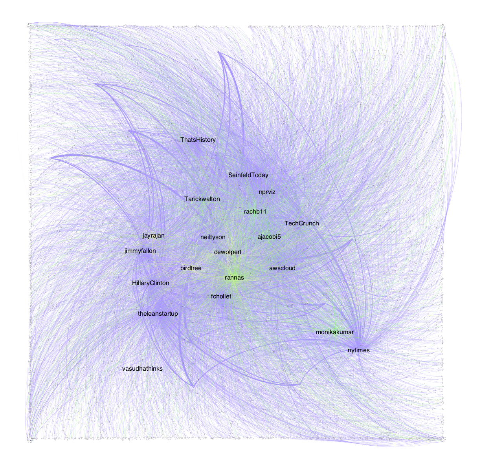

# Who Follows My Friends? 

In this short exercise, I wanted to explore the popularity of the people/organizations (users) I follow on Twitter. 
Since I joined Twitter back in 2009, it has evolved tremendously and I imagine people use it differently--I know I do. 
When I first joined, I only followed friends and some famous names. Since then, however, Twitter for me has become less of a way to connect with friends, but more of an information channel where I follow more famous names than people I personally know. 

Along this vein, I wanted to explore how popular are the users that I follow? Are the majority of them companies or celebrities that have millions of followers? Have the people I know personally grown to have large followerships? 

I follow about 110 users on Twitter but capturing the followership of all 110+ users would be tedious on the [Twitter API](https://developer.twitter.com/en/docs/accounts-and-users/follow-search-get-users/api-reference/get-followers-ids) and [Tweepy](http://docs.tweepy.org/en/v3.5.0/) and cumbersome to plot on [Gephi](https://gephi.org/). 

I learned the hardships of rate limits early (referring to the "tedious on the Twitter API" above) and decided to get information on every 5th user I follow on Twitter, which at the time equated to 22 users. For the 22 users, I used Tweepy to get all their followers. The Twitter API returns 5,000 followers at a time per user (per page), which I thought could be good testing ground. For the 22 users, this returned over 56,000 users, which when plotted on Gephi was difficult to discern and burdensome on its in-built network algorithms (referring the the "cumbersome to plot on Gephi" above). 

##### Here's an image of 56,000+ nodes and their edges (representing users and connections): 

The above is a lot of information to pass through to Gephi (in case the scale is not clear, look closely at the edges -- the sparse dots indicate an indiviudal user -- the denser areas are composed of thousands). Following this, I decided to use the first 1,000 followers of each of the 22 users I follow. This led me to some 8,000+ nodes.

##### An image of 8,000+ nodes and their edges: 

This, while still a great deal of information, we can work with. 

##### To recap, the graph I'm creating shows (in the form of Twitter usernames): 
1. Me
1. 22 users I follow (Twitter calls these my friends)
1. Upto 1,000 users that follow each of my 22 friends (Twitter calls these followers)

With this information, we create a directed graph in the form follower --[follows]--> friend (this is point 3 above). We also have I(me) --[follow]--> friend (which is points 1 and 2 above but, as we'll soon see, not as noticable). 

We're still working with over 8,000 nodes so to be selective, I decide to label all nodes that have an in-degree of 50 or above, which means, they have at least 50 users following them (this turns out to be 19 of my 22 friends). This leads to the __meat of the question__: of my friends, who or what portion are famous names with many, many followers and how many are people I personally know who are still somewhat present/active on Twitter (this was the decision to choose 50 as the in-degree cut-off).

##### Findings: 
It turns out of the 19 labeled friends, 11 are users who are famous names, organizations, etc. (with many more than 1,000 users, though 1,000 is all that's shown here) and 8 are people I personally know who have [hopefully organically] acquired between 50 and 550 followers. Here's a rasterized version of the final output: 

What you see: 1. The 19 labeled friends (plus me, toward the bottom left), 2. So many edges -- colored according to the in-degree value, ranging from 50 to 1,001 (1,001, because I am also a follower of my friends), 3. Breaking down point 2 further: the purple indicate followership of 1,000+, the green denote a range between 150 - 500 (with more saturated green toward the top of the range), and the yellow denote a range between 50 - 150. 

So, from this graph, what else have I learned? Let's look at this closer: 

The purple edges are weighted and they draw attention to followers of my friends who follow the same users as me (or in Twitter terms, have the same friends as me). Wait what? So, for example, I follow @nytimes (bottom right corner); @nytimes has millions of followers, but let's focus on one shown here:

The edge with a large, thick red arrow points to a user I am not connected to, however, this user also follows @neiltyson, @jimmyfallon, and @HillaryClinton, shown with smaller red arrows (i.e.: this user follows the same users as I do or has the same friends as me!). And there are many users out there like this depicted by the other weighted purple edges. 

So, what this means is that: 1. I may actually know these users who are 2-degrees removed but I am not connected to them on Twitter (highly unlikely for the 11 famous users, but may be true if there are thicker weighted edges among the 8 personally known users), or 2. I and these 2-degree removed users have a degree of similar taste -- we could create some sort of litmus test that would show a percentage of similarity or similar taste and place us into groups/clusters (could in turn be used for recommendation, targeting information, advertising).

Who would've thought--I was not anticipating this when I began. I had expected myself to be at the center of the graph with clusters of nodes surrounding me with some overlapping edges. As has became evident, however, with the way I chose and structured my data, I am not at the center of this graph, but there are more connections between me and unknown users than I had considered. (It's possible that if I continue to run different built-in algorithms in Gephi, I could achieve something of my expectation, but I don't find that to be necessary.) 

Really, though? And what next?
The above are educated theories and to see if they hold any validity, we'd have to run some experiments and tests. And what I've said isn't out of the ordinary of how many social networks may already recommend connections or target advertising. I imagine this could also be applied to links--creating a directed graph of how webpages are connected to one another. 
